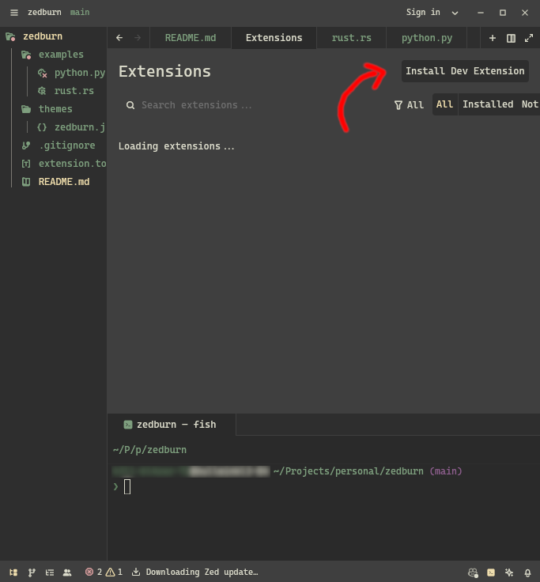
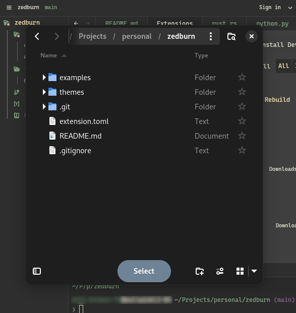
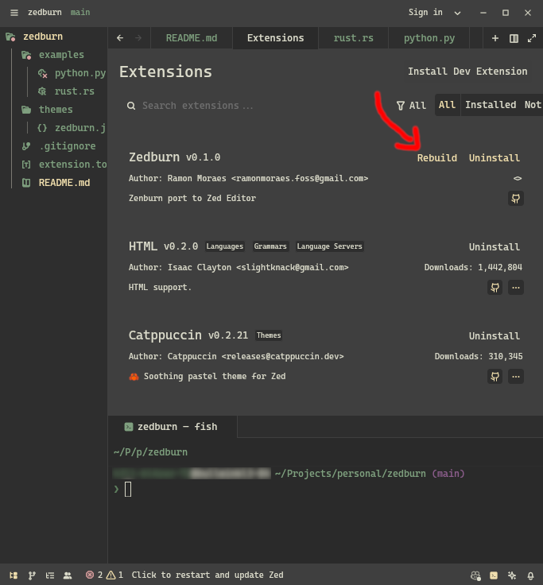

## Development

### Install For Preview

- Step 0 - Open up the command palette and type extensions

- Step 1 - Click on "Instal Dev Extension"

- Step 3 - Find the extension folder

- Step 4 - Once you finish your changes, reopen the "Extensions" and click to reload.

### Helpful Links

- https://vimhelp.org/syntax.txt.html
- https://zed.dev/docs/themes#local-themes
- https://zed.dev/docs/extensions/themes
